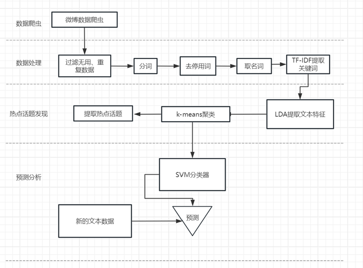

# Analysis Project of Hot Topics in the Israeli-Palestinian Conflict
# 巴以冲突热点话题分析项目

---
## The project is based on Internet data and focuses on modeling, extracting, and analyzing hot topics related to the situations in both Israel and Palestine
## 本项目基于互联网数据，对巴以两国局势进行热点话题的建模、提取和舆情分析。

---

**The main content can be divided into the following five parts:**

**1.Basic methods and processes for preprocessing textual data.**

**2.Representation methods for textual data based on the LDA topic model.**

**3.Methods and basic processes for topic discovery and tracking based on clustering methods.**

**4.Analysis of the impact of extracted hot topics on public opinion in two countries and on global politics and economy.**

**5.Predictive analysis of hot topics based on new textual data.**

**主要分解为以下5部分内容：**

**1.文本数据的预处理基本方法和基本流程；**

**2.基于LDA主题模型的文本的表示方法；**

**3.基于聚类方法的主题发现和跟踪方法及基本流程；**

**4.基于所提取的热点话题，对两国舆情及对全球政治经济的影响进行分析；**

**5.基于新的文本数据，对热点话题进行预测分析。**

### Architecture and Workflow

---
## dataset

本项目数据分为中文数据和英文数据两种:

中文数据由微博爬虫得到，主要为新闻、用户评论。

英文数据直接下载得到，为分词后的形式，主要为新闻。

|       文件名       | 数据开始时间 | 数据结束时间 | 数据量（条） |
| :----------------: | :----------: | :----------: | :----------: |
|      data.csv      |  2023年4月   |  2023年11月  |    37673     |
| tokenized_text.txt |      -       |      -       |     4299     |

---

## Requirements
<ul>
<li>requests~=2.28.1</li>
<li>pandas~=1.5.2</li>
<li>jsonpath~=0.82.2</li>
<li>numpy~=1.21.5</li>
<li>matplotlib~=3.6.2</li>
<li>scikit-learn~=1.2.0</li>
<li>jieba~=0.42.1</li>
<li>gensim~=4.3.2</li>
<li>nltk~=3.7</li>
<li>wordcloud~=1.9.2</li>
<li>pillow~=9.3.0</li>
<li>pyldavis~=3.4.0</li>
<li>adjusttext~=0.8</li>
</ul>

---

## 贡献代码

由于程序存在很多没有改进的地方，极力欢迎各位对程序进行改进。 

对于重大更改，请先打开一个issue，讨论想要更改的内容。

1.Fork本项目，点击右上角的Fork按键即可。

2.上传文件到已有文件夹：打开对应文件夹，点击Download按钮旁的upload，上传你的文件。

3.上传文件到新文件夹：打开任意文件夹，点击Download按钮旁的upload，把浏览器地址栏中文件夹名称改为你想要新建的文件夹名称，然后回车，上传你的文件。

4.提交 PR：上传完文件到个人仓库之后，点击 Pull Request 即可。请留意一下项目的文件组织。

5.也可以直接附加在 Issue 中，由维护者进行添加。

 请确保根据需要更新测试。 
